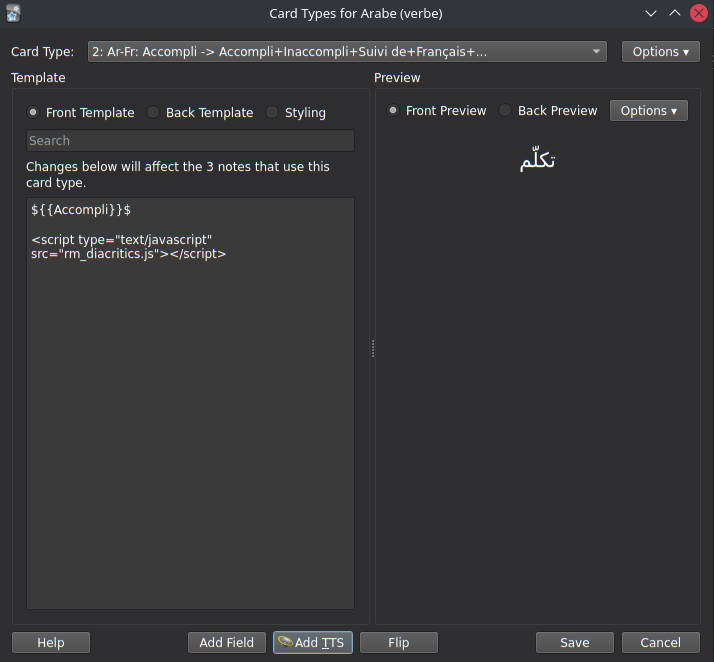
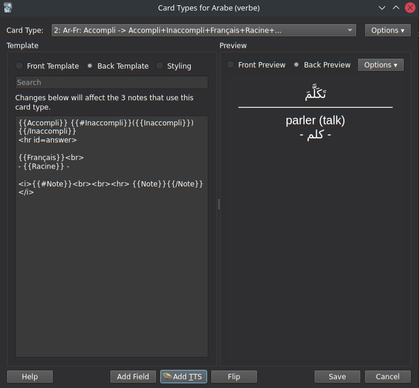
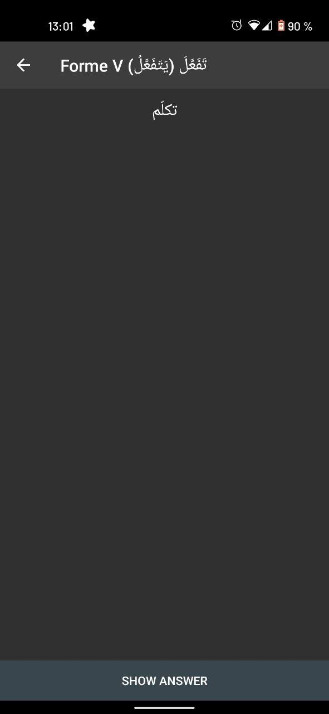
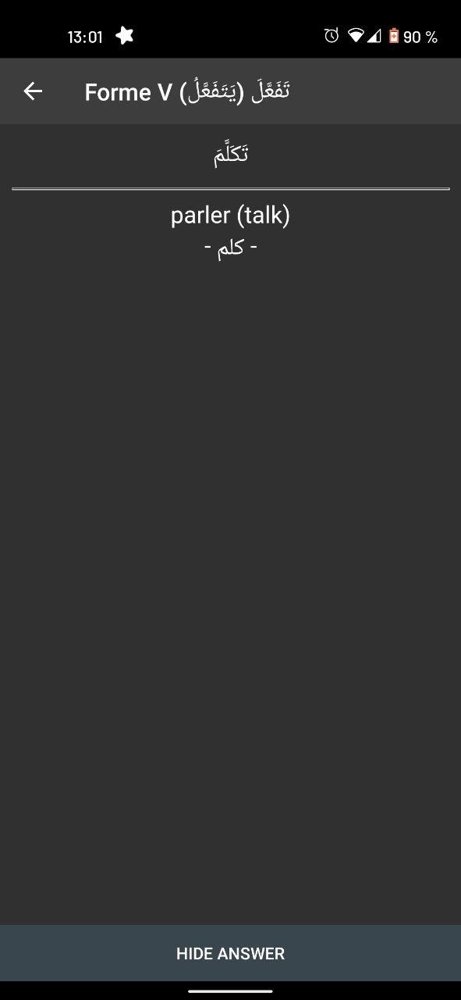

#  Optionally remove diacritics in Arabic cards on Anki

### Presentation

This is a short script that allows removing diacrtitics in Arabic words/phrases on Anki flashcards. It can be used to learn arabic pronunciation, by hiding the vowels on the front side, and revealing it on the back.

It was written with cross-platform adaptability in mind, which is why it is written in javascript, and is not an official Anki add-on.

I tested this on Anki 2.1.48 (on linux) and on AnkiDroid 2.15.6. It would probably work on most platforms, but there is no guarantee it will.

### Installation

To be able to use this script inside your cards, copy the file `rm_diacritics.js` into the folder `collection.media` inside your Anki installation folder.

On a linux system, the intallation folder is usually `~/.local/share/Anki2`

If you are using multiple devices (for example, desktop app and AnkiDroid), the file will be automatically uploaded on all devices on next sync.

### Usage

In every card you want to use this script on, add `<script type="text/javascript" src="rm_diacritics.js"></script>` at the end. To remove diacritics in a portion of the card, simply surround it by '$', like this :

```text
${{VariableToSimplify}}$
or
$Text to simplify$
```

### Examples

On desktop Anki 2.1.48:




On AnkiDroid 2.15.6:

<p float="left">
  
  
</p>